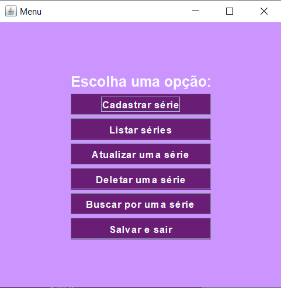
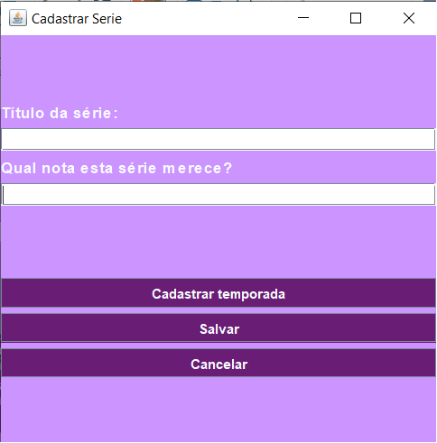
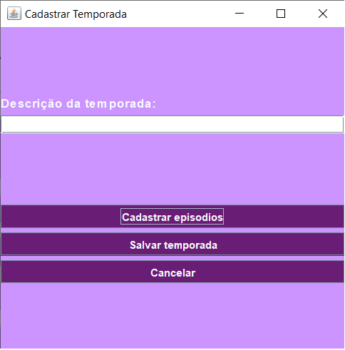
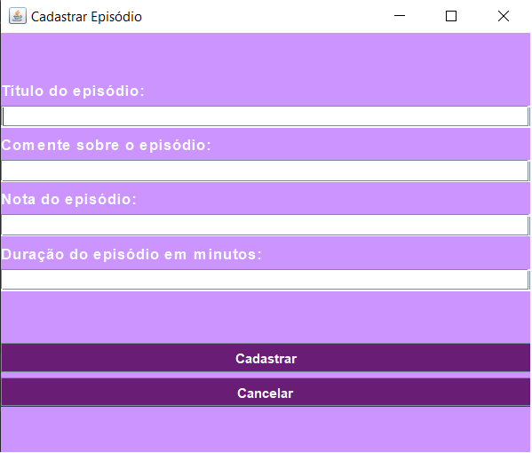
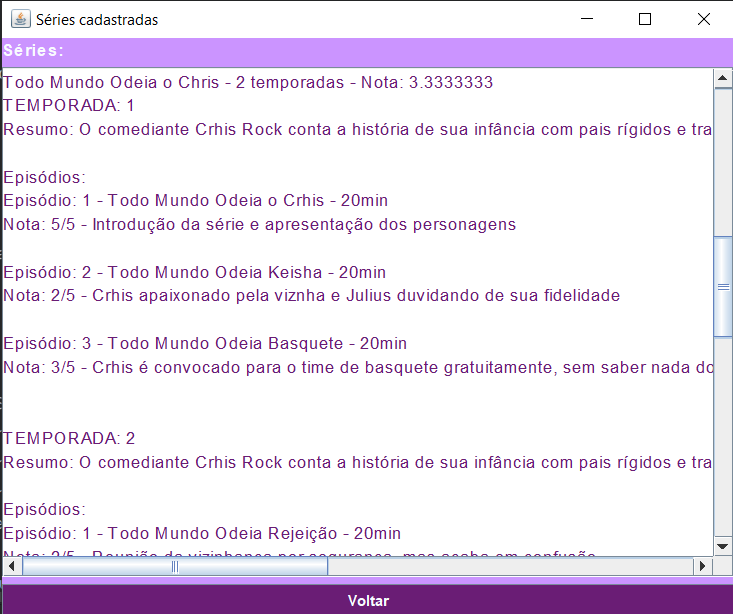
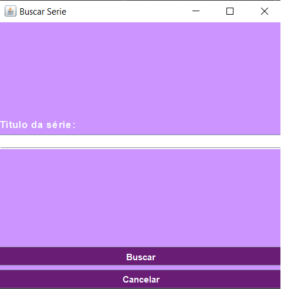
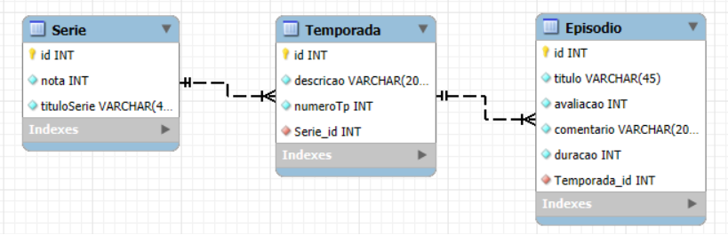

## Exercicio de POO (Programação Orientada a Objeto) - Gerenciamento de Series
Este exercício foi realizado com a supervisão e orientação do meu professor @BiaginiMatheus, utilizando a linguagem Java e apresentando integração com banco de dados através do MySQL.

Neste exercício foram criadas telas para o controle de Séries, apresentando um CRUD (_Create, Read, Update, Delete_ - Criar, Ler, Atualizar, Excluir) completo, além da inserção de temporadas e episódios para a série, estando descritos detalhadamente a seguir.

### 1- MENU
Para a primeira tela temos o menu, onde o usuário pode selecionar o que fará a seguir. Esta tela apresenta botões funcionais que fazem o redirecionamento do usuário para as outras telas referente à sua escolha. Contudo, há um único botão que não segue esta premissa, o botão "Salvar e sair", ele, como o nome sugere, salva os dados em um arquivo de texto e fecha o programa completamente.

 

### 2- CADASTRAR SÉRIE
Ao clicar no botão "Cadastrar série" o usuário é redirecionado para uma tela onde ele consegue e deve preencher dados referentes a série que deseja registrar. Após finalizar, espera-se que siga para a adição de temporadas à série utilizando o botão "Cadastrar temporada", que será exemplificado a seguir. Após a inserção dos dados o usuário pode também salvar apenas a série vazia clicando em "Salvar", recebendo uma confirmação com opções de adicionar novas séries ou apenas a atual. Ou cancelar as ações e voltar para o menu utilizando o botão "Cancelar".

### 3- CADASTRAR TEMPORADA
Caso o usuário tenha clicado no botão "Cadastrar temporada" na tela anterior para seguir preenchendo os dados da série, ele será redirecionado para a tela de cadrasto de temporada, onde adicionará os dados referentes a mesma. Após finalizar a inserção dos dados ele terá opções semelhantes ao cadastro de série, um botão "Adicionar episódios" que será descrito a seguir, o botão "Salvar temporada" que, quando clicado lançará uma confirmação com opções de adicionar novas temporadas ou apenas a atual, e a opção de cancelar as ações e voltar para o cadastro da série utilizando o botão "Cancelar". 

### 4- CADASTRAR EPISÓDIOS
Para finalizar o cadastro de uma série, o usuário adicionará os episódios referentes a temporada pré cadastrada utilizando a tela ilustrada nesta seção. Aqui deverão ser inseridos os dados referentes ao episódio desejado. Após a inserção dos dados o usuário deve utilizar o botão "Cadastrar", ao finalizar o cadastro receberá um alerta de confirmação com opções para cadastrar mais episódios nesta mesma temporada ou apenas o atual. Além da opção de cancelar as ações e voltar para o o cadastro da temporada utilizando o botão "Cancelar". 

### 5- LISTAR SÉRIES
Nesta tela o usuário tem acesso a lista das séries cadastradas previamente com todos os dados inseridos, como notas, temporadas e episódios, por exemplo. Utilizando o botão "Voltar" esta tela é fechada e o menu se abrirá novamente.

### 6- BUSCAR SÉRIE
Esta é uma tela muito versátil dentro da aplicação, sendo utilizada para algumas funções:
- __Buscar:__ onde o usuário pode buscar uma série do banco de dados utilizando o título cadastrado. Caso encontrada, será listada em uma nova tela, caso não, receberá um alerta de erro.
- __Atualizar:__ ao clicar no botão "Atualizar série" no menu, uma tela de busca se abre e o usuário pode encontrar a série a ser atualizada pelo título. Caso encotrada, o programa abrirá as telas de cadastro em sequência para que os dados já preenchidos possam ser atualizados, caso contrário, um alerta de erro é mostrado.
- __Deletar:__ para excluir uma série, basta encontrá-la por seu título e, caso encotrada, confirmar em um alerta de confirmação se tem certeza que quer mesmo excluir aquela série, após confirmado ela é excluída permanentemente. Caso não seja encontrada, um alerta de erro será mostrado.

Todas as telas citadas têm validações para os dados inseridos, inclusive para campos em branco, enviando alertas na tela sobre a inconsistência dos dados ou a falta dos mesmos, dando oportunidade para o usuário corrigir os erros.

Para a utilização do banco de dados neste exercício, fizemos um DER (Diagrama de Entidade e Relacionamento) para assim conseguirmos adicionar os dados que seriam lidos pelo programa posteriormente. 

Além disso, preparamos também um Diagrama de Classes para exemplificar as relações entre as classes presentes. Infelizmente não foi possível concluir a alteração do modo de salvamento de dados e fazê-lo unicamente com o MySQL, pois este exercício foi projetado para ter os dados lidos e salvos em um arquivo de texto. Após concluir este objetivo houve a tentativa da adição do banco de dados para a realização desta trefa, mas seria muito complexo mudar o modo de salvamento dos dados, então apenas a leitura foi transferida. Foi utilizado um [script](./src/main/java/com/mycompany/expooserie/dbserie.sql) juntamente com o DER para a adição dos valores nas tabelas que seriam lidas posteriomente pelo programa.
Neste diagrama as classes foram separadas por cor baseado na organização do programa utilizando MVC(_Model, View, Controller_ - Modelo, Visão, Controle):
- verde: controle
- azul: visão
- rosa: relação com o banco de dados
- laranja: modelo

